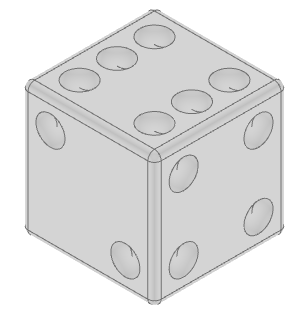
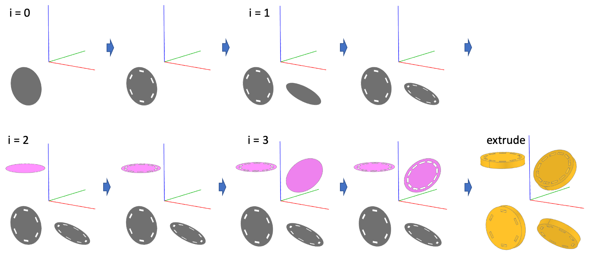

# Alg123d

## Overview

`class AlgCompound(build123d.Compound)`

**Additional properties:**

- `dim`: Dimensionality of the `AlgCompound a` with `a.dim in [0,1,2,3]`: 0=empty, 1=line, 2=sketch, 3=part

**Additional user facing operators:**

- `+`: `(AlgCompound, AlgCompound) -> AlgCompound`: Fuse two objects
- `-`: `(AlgCompound, AlgCompound) -> AlgCompound`: Cut first object with second object
- `&`: `(AlgCompound, AlgCompound) -> AlgCompound`: Intersect two objects
- `@`: `(AlgCompound, Plane|Location) -> AlgCompound`: Change location of an AlgCompound

Proxying build123d operators `position_at` and `tangent_at` to a line object (`dim==1` only)

- `@`: `(AlgCompound, float) -> Vector`: `position_at` for AlgCompound with `dim==1` 
- `%`: `(AlgCompound, float) -> Vector`: `tangent_at` for AlgCompound with `dim==1`

Another important operator is used from build123d:

- `*`: `(Location, Location) -> Location`: Multiple (concatenate) two locations
- `*`: `(Plane, Location) -> Plane`: Change location of a plane

**Objects:**

- 3-dim: {`Empty`, `Box`, `Cylinder`, `Cone`, `Sphere`, `Torus`, `Wedge`, `Bore`, `CounterBore`, `CounterSink`}
- 2-dim: {`Empty`, `Rectangle`, `Circle`, `Ellipse`, `Rectangle`, `Polygon`, `RegularPolygon`, `Text`, `Trapezoid`, `SlotArc`, `SlotCenterPoint`, `SlotCenterToCenter`, `SlotOverall`}
- 1-dim: {`Empty`, `Bezier`, `PolarLine`, `Polyline`, `Spline`, `Helix`, `CenterArc`, `EllipticalCenterArc`, `RadiusArc`, `SagittaArc`, `TangentArc`, `ThreePointArc`, `JernArc`}

**Functions:**

- 3-dim: {`extrude`, `extrude_until`, `loft`, `revolve`, `sweep`, `section`, `shell`}
- 2-dim: {`make_face`}

**Shortcuts:**

Usually used by importing `import alg123d.shortcuts as S` to avoid polluting the namespace:

- Transform a mixed list of planes, faces and locations to a list of planes: `S.planes`

- Get the difference of two ShapeLists: `S.diff`
    
    Use case: Get the edges, faces, solids created by the last transformation

    ```python
    last = obj.faces()
    obj = my_transformation(obj)
    diff = S.diff(obj.faces(), last)
    ```
    
- Get the minimum or maximum element of a Shapelist in axis direction: `S.sort_min` and `S.sort_max`

- Get minimum or maximim shape in axis direction: `S.min_<shape>` and `S.max_<shape>` (for `<shape>` in `solid`, `face`, `edge`, `vertex`)

- Get the minimum or maximum group of a Shapelist in axis direction: `S.group_min` and `S.group_max`

- Get the minimum or maximum group of shapes in axis direction: `S.min_<shapes>` and `S.max_<shapes>` (for `<shapes>` in `solids`, `faces`, `edges`, `vertices`)

## Usage

### Object creation

```python
b = Box(1,2,3)
```

is an `AlgCompound` placed on the `XY` plane. It can be immediately shown. `AlgCompund`s do not have any location or rotation paramater. They will be relocated with the `@` operator (see below) which will then be reflected in the `location` property of the underlying `build123d.Compound`.

### Object arithmetic

- Fusing a box and a cylinder:

    ```python
    f = Box(1,2,3) + Cylinder(0.2, 5)
    ```

- Cutting a cylinder from a box

    ```python
    f = Box(1,2,3) - Cylinder(0.2, 5)
    ```
- Interseting a box and a cylinder

    ```python
    f = Box(1,2,3) & Cylinder(0.2, 5)
    ```

### Location handling

- Box at `origin = (0,0,0)` without rotation:

    ```python
    b = Box(1,2,3)
    ```

- Box at `origin = (0,1,0)` without rotation:

    ```python
    b = Box(1,2,3) @ Location((0,1,0))
    b = Box(1,2,3) @ (0,1,0)             # shortcut
    ```

- Box at `origin = (0,0,0)` with `rotation = (0, 100, 45)`:

    ```python
    b = Box(1,2,3) @ Rotation((0, 100, 45))
    ```

- Box at `origin = (0,1,0)` with `rotation = (0, 100, 45)`:

    ```python
    b = Box(1,2,3) @ Location((0,1,0), (0,100,45))
    ```

- Box on plane `Plane.YZ`:

    ```python
    b = Box(1,2,3) @ Plane.XZ
    ```

- Box on plane `Plane.YZ` rotated around `X` by 45°:

    ```python
    b = Box(1,2,3) @ (Plane.XZ * Rotation(45, 0, 0))
    ```

### Examples

**Dice**

```python
from alg123d import *
import alg123d.shortcuts as S

width = 1.6
fillet_radius = 0.08
dist = 0.9
eye_radius = 0.23
eye_offset = 0.15

eye_locs = list(GridLocations(dist, dist / 2, 2, 3)) + [Location((0, 0, 0))]

def eyes(face, ind):
    """build a compound of spheres representing the eyes of a side"""
    p = Plane(face) * Location((0, 0, eye_offset))  # eye offset above plane
    rv = Empty()
    for loc in [eye_locs[i] for i in ind]:
        rv += Sphere(eye_radius) @ (p * loc)
    return rv

# create the actual body
dice = Box(width, width, width)
dice = fillet(dice, dice.edges(), fillet_radius)

# define sides and their eyes
sides = [
    (S.min_face(dice, Axis.Z), [6]),  # 1
    (S.max_face(dice, Axis.Z), [0, 1, 2, 3, 4, 5]),  # 6
    (S.min_face(dice, Axis.Y), [0, 5]),  # 2
    (S.max_face(dice, Axis.Y), [0, 2, 3, 5, 6]),  # 5
    (S.min_face(dice, Axis.X), [2, 3, 6]),  # 3
    (S.max_face(dice, Axis.X), [0, 2, 3, 5]),  # 4
]

# and cut out the eyes
for side in sides:
    dice -= eyes(*side)
```



**Location handling**

```python
plane = Plane.ZX

# Four rotations around Y
rotations = [Rotation(0, a, 0) for a in (0, 45, 90, 135)]

# initialize result with "zero"
s = Empty()  

# get four locations on a grid 
for i, outer_loc in enumerate(GridLocations(3, 3, 2, 2)):  

    # move the ZX plane to one of the four grid locations and rotate it aropund Y
    c_plane = plane * outer_loc * rotations[i]
    
    # Create a circle and place it the c_plane.
    # Fuse the result with s (hence we need to initiailize s with Empty for the first loop)
    s += Circle(1) @ c_plane
    
    # Get a different amount of polar locations per loop
    for loc in PolarLocations(0.8, (i + 3) * 2):
    
        # place the polar location onto the c_plane
        # and create a rectangle at this location
        # cut the rectangle from s
        s -= Rectangle(0.1, 0.3) @ (c_plane * loc)

# Finally extrude each rotated circle with cuts in the circle normal direction
e = extrude(s, 0.3)
```



## API

### 3-dim objects (parts)

```python
Box(
    length: float, 
    width: float, 
    height: float, 
    centered: bool | Tuple[bool, bool, bool] = (True, True, True)
    )

Cylinder(
    radius: float, 
    height: float, 
    arc_size: float = 360, 
    centered: bool | Tuple[bool, bool, bool] = (True, True, True)
)

Cone(
    bottom_radius: float, 
    top_radius: float, 
    height: float, 
    arc_size: float = 360, 
    centered: bool | Tuple[bool, bool, bool] = (True, True, True)
)

Sphere(
    radius: float, 
    arc_size1: float = -90, 
    arc_size2: float = 90, 
    arc_size3: float = 360, 
    centered: bool | Tuple[bool, bool, bool] = (True, True, True)
)

Torus(
    major_radius: float, 
    minor_radius: float, 
    minor_start_angle: float = 0, 
    minor_end_angle: float = 360, 
    major_angle: float = 360, 
    centered: bool | Tuple[bool, bool, bool] = (True, True, True)
)

Wedge(
    dx: float, 
    dy: float, 
    dz: float, 
    xmin: float, 
    zmin: float, 
    xmax: float, 
    zmax: float
)

CounterBore(
    part: AlgCompound, 
    radius: float, 
    counter_bore_radius: float, 
    counter_bore_depth: float, 
    depth: float = None
)

CounterSink(
    part: AlgCompound, 
    radius: float, 
    counter_sink_radius: float, 
    counter_sink_angle: float = 82, 
    depth: float = None
)

Bore(
    part: AlgCompound, 
    radius: float, 
    depth: float = None
)
```
### 3-dim functions

```python
extrude(
    to_extrude: Compound, 
    amount: float = None, 
    both: bool = False, 
    taper: float = 0.0
) -> AlgCompound

extrude_until(
    face: Face | AlgCompound, 
    limit: AlgCompound
    taper: float = 0.0
) -> AlgCompound

loft(
    sections: List[AlgCompound | Face], 
    ruled: bool = False
) -> AlgCompound

revolve(
    profiles: List[Compound | Face] | Compound | Face, 
    axis: Axis, 
    arc: float = 360.0
) -> AlgCompound

sweep(
    sections: List[Compound | Face], 
    path: Edge | Wire = None, 
    multisection: bool = False, 
    is_frenet: bool = False, 
    transition: Transition = Transition.TRANSFORMED, 
    normal: Union[Vector, tuple[float, float], tuple[float, float, float]] = None, 
    binormal: Edge | Wire = None
) -> AlgCompound

section(
    part: AlgCompound, 
    by: List[Plane], 
    height: float = 0.0
) -> AlgCompound

shell(
    objects: List[AlgCompound] | AlgCompound], 
    amount: float, 
    openings: Face | List[Face] = None, 
    kind: Kind = Kind.ARC
)  -> AlgCompound
```

### 2-dim objects (sketches)

```python
Circle(
    radius: float, 
    centered: bool | Tuple[bool, bool] = (True, True)
)

Ellipse(
    x_radius: float, 
    y_radius: float, 
    centered: bool | Tuple[bool, bool] = (True, True)
)

Rectangle(
    width: float, 
    height: float, 
    centered: bool | Tuple[bool, bool] = (True, True)
)

Polygon(
    pts: List[Vector | tuple[float, float] | tuple[float, float, float]]
    )

RegularPolygon(
    radius: float, 
    side_count: int, 
    centered: bool | Tuple[bool, bool] = (True, True)
)

Text(
    txt: str, 
    fontsize: float, 
    font: str = 'Arial', 
    font_path: str = None, 
    font_style: FontStyle = FontStyle.REGULAR, 
    halign: Halign = Halign.LEFT, 
    valign: Valign = Valign.CENTER, 
    path: Edge | Wire = None, 
    position_on_path: float = 0.0
)

Trapezoid(
    width: float, 
    height: float, 
    left_side_angle: float, 
    right_side_angle: float = None, 
    centered: bool | Tuple[bool, bool] = (True, True)
)

SlotArc(
    arc: Edge | Wire, 
    height: float
)

SlotCenterPoint(
    center: Vector | tuple[float, float] | tuple[float, float, float], 
    point: Vector | tuple[float, float] | tuple[float, float, float], 
    height: float
)

SlotCenterToCenter(
    center_separation: float, 
    height: float
)

SlotOverall(
    width: float, 
    height: float
)
```

### 2-dim functions

```python
make_face(
    objs: AlgCompound, | List[Edge]
)  -> AlgCompound
```

### 1-dim objects (lines)

```python
Line(
    start: Vector | tuple[float, float] | tuple[float, float, float], 
    end: Vector | tuple[float, float] | tuple[float, float, float]
)

Bezier(
    cntl_pts: Iterable[Vector | tuple[float, float] | tuple[float, float, float]], 
    weights: List[float] = None
)

PolarLine(
    start: Vector | tuple[float, float] | tuple[float, float, float], 
    length: float, 
    angle: float = None, 
    direction: Vector | tuple[float, float] | tuple[float, float, float] = None
)

Polyline(
    pts: List[Vector | tuple[float, float] | tuple[float, float, float]], 
    close: bool = False
)

Spline(
    pts: Iterable[Vector | tuple[float, float] | tuple[float, float, float]], 
    tangents: Iterable[Vector | tuple[float, float] | tuple[float, float, float]] = None, 
    tangent_scalars: Iterable[float] = None, 
    periodic: bool = False
)

Helix(
    pitch: float, 
    height: float, 
    radius: float, 
    direction: Vector | tuple[float, float] | tuple[float, float, float] = (0, 0, 1), 
    cone_angle: float = 0, 
    lefthand: bool = False
)

CenterArc(
    center: Vector | tuple[float, float] | tuple[float, float, float], 
    radius: float, 
    start_angle: float, 
    arc_size: float
)

EllipticalCenterArc(
    center: Vector | tuple[float, float] | tuple[float, float, float], 
    x_radius: float, 
    y_radius: float, 
    start_angle: float = 0.0, 
    end_angle: float = 90.0, 
    angular_direction: AngularDirection = AngularDirection.COUNTER_CLOCKWISE, 
    plane: Plane = Plane(o=(0.00, 0.00, 0.00), x=(1.00, 0.00, 0.00), z=(0.00, 0.00, 1.00))
)

RadiusArc(
    start_point: Vector | tuple[float, float] | tuple[float, float, float], 
    end_point: Vector | tuple[float, float] | tuple[float, float, float], 
    radius: float
)

SagittaArc(
    start_point: Vector | tuple[float, float] | tuple[float, float, float], 
    end_point: Vector | tuple[float, float] | tuple[float, float, float], 
    sagitta: float
)

TangentArc(
    start_point: Vector | tuple[float, float] | tuple[float, float, float], 
    end_point: Vector | tuple[float, float] | tuple[float, float, float], 
    tangent: Union[Vector, tuple[float, float], tuple[float, float, float]], 
    tangent_from_first: bool = True
)

ThreePointArc(
    p1: Vector | tuple[float, float] | tuple[float, float, float], 
    p2: Vector | tuple[float, float] | tuple[float, float, float], 
    p3: Vector | tuple[float, float] | tuple[float, float, float]
)

JernArc(
    start: Vector | tuple[float, float] | tuple[float, float, float], 
    tangent: Vector | tuple[float, float] | tuple[float, float, float], 
    radius: float, 
    arc_size: float, 
    plane: Plane = Plane(o=(0.00, 0.00, 0.00), x=(1.00, 0.00, 0.00), z=(0.00, 0.00, 1.00))
)
```

### Shortcuts

Usually used by importing `import alg123d.shortcuts as S` to avoid polluting the namespace:

```python
    S.planes(objs: List[Union[Plane, Location, Face]]) -> List[Plane]

    S.diff(l1: List[Shape], l2: List[Shape]) -> ShapeList

    sort_min(s: ShapeList, axis: Axis = Axis.Z) -> Union[Solid, Face, Wire, Edge, Vertex]
    sort_max(s: ShapeList, axis: Axis = Axis.Z) -> Union[Solid, Face, Wire, Edge, Vertex]

    S.min_solid(a: Compound, axis=Axis.Z, wrapped=False) -> Union[Compound, <Solid>]
    S.max_solid(a: Compound, axis=Axis.Z, wrapped=False) -> Union[Compound, <Solid>]
    S.min_face(a: Compound, axis=Axis.Z, wrapped=False) -> Union[Compound, <Face>]
    S.max_face(a: Compound, axis=Axis.Z, wrapped=False) -> Union[Compound, <Face>]
    S.min_edge(a: Compound, axis=Axis.Z, wrapped=False) -> Union[Compound, <Edge>]
    S.max_edge(a: Compound, axis=Axis.Z, wrapped=False) -> Union[Compound, <Edge>]
    S.min_vertex(a: Compound, axis=Axis.Z, wrapped=False) -> Union[Compound, <Vertex>]
    S.max_vertex(a: Compound, axis=Axis.Z, wrapped=False) -> Union[Compound, <Vertex>]

    group_min(s: ShapeList, axis: Axis = Axis.Z) -> ShapeList
    group_max(s: ShapeList, axis: Axis = Axis.Z) -> ShapeList

    S.min_solids(a: Compound, axis=Axis.Z) -> ShapeList
    S.max_solids(a: Compound, axis=Axis.Z) -> ShapeList
    S.min_faces(a: Compound, axis=Axis.Z) -> ShapeList
    S.max_faces(a: Compound, axis=Axis.Z) -> ShapeList
    S.min_edges(a: Compound, axis=Axis.Z) -> ShapeList
    S.max_edges(a: Compound, axis=Axis.Z) -> ShapeList
    S.min_vertices(a: Compound, axis=Axis.Z) -> ShapeList
    S.max_vertices(a: Compound, axis=Axis.Z) -> ShapeList
```

## Algebraic definition

### Objects and object arithmetic

$A^n$ is the set of all `AlgCompounds a` with `a.dim = n` for $n = 1,2,3$

$e_n$ := `Empty` , for $n = 1,2,3$ , are `AlgCompounds a` with `a.dim = n` and `a.wrapped = None`

**Sets of predefined basic shapes:**

$B^3 := \lbrace$`Empty`, `Box`, `Cylinder`, `Cone`, `Sphere`, `Torus`, `Wedge`, `Bore`, `CounterBore`, `CounterSink`$\rbrace$

$B^2 := \lbrace$`Empty`, `Rectangle`, `Circle`, `Ellipse`, `Rectangle`, `Polygon`, `RegularPolygon`, `Text`, `Trapezoid`, `SlotArc`, `SlotCenterPoint`, `SlotCenterToCenter`, `SlotOverall`$\rbrace$

$B^1 := \lbrace$`Empty`, `Bezier`, `PolarLine`, `Polyline`, `Spline`, `Helix`, `CenterArc`, `EllipticalCenterArc`, `RadiusArc`, `SagittaArc`, `TangentArc`, `ThreePointArc`, `JernArc`$\rbrace$

with $B^n \subset A^n$

**Operations:**

$+: A^n \times A^n \rightarrow A^n$ with $(a,b) \mapsto a + b$ , for $n=1,2,3$

$\\;\\;\\;\\;\\;\\; a + b :=$ `a.fuse(b)`

$-: A^n \rightarrow A^n$ with $a \mapsto -a$ , for $n=1, 2,3$

$\\;\\;\\;\\;\\;\\; b + (-a)$ := `b.cut(a)` (implicit definition)

$\\& : A^n \times A^n \rightarrow A^n$ with $(a,b) \mapsto a \\; \\& \\; b$ , for $n=2,3$

$\\;\\;\\;\\;\\;\\; a \\; \\& \\; b :=$ `a.intersect(b)` (note: $a \\; \\& \\; b = (a + b) + -(a + (-b)) + -(b + (-a))$ )


**Abelian groups**

$( A^n, e_n, +, -)$ is an abelian group for $n=2,3$

$( A^1, e_1, +)$ is an abelian semigroup

Note: The implementation `a - b = a.cut(b)` needs to be read as $a + (-b)$ since the group does not have a binary $-$ operation. As such, $a - (b - c) = a + -(b + -c)) \ne a - b + c$

### Locations, planes and location arithmentic

$L  := \lbrace$ `Location` $((x,y,z), (a,b,c)): x,y,z \in R \land a,b,c \in R\rbrace$ with $a,b,c$ being angles in degrees

$P  := \lbrace$ `Plane` $(o,x,z): o,x,z ∈ R^3 \land \|x\| = \|z\| = 1\rbrace$

For $n = 1, 2, 3$:

$*: L \times L \rightarrow L$ (multiply two locations $l_1, l_2 \in L$, i.e. `l1 * l2`)

$*: P \times L \rightarrow P$ (locate plane $p \in P$ at location $l \in L$, i.e. `Plane(p.to_location() * l)`)

Neutral element: $l_0 \in L$: `Location()`

Inverse element: $l^{-1} \in L$: `l.inverse()`

### Placing objects on planes and at locations:

For $n = 1, 2, 3$:

$@: A^n \times L \rightarrow A^n$ (locate an object $a \in A^n$ at location $l \in L$, i.e. `a.located(l)`)

$@: A^n \times P \rightarrow A^n$ (locate an object $a \in A^n$ on a plane $p \in P$, i.e. `a.located(p.to_location())`)

