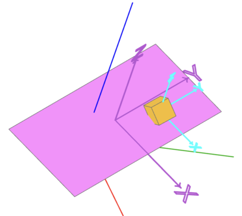

# Locations

## Position a shape

1. **Absolute positioning at a location**

    ```python
    loc = Location((0.1, 0.2, 0.3), (10, 20, 30))

    face = Rectangle(1,2) @ loc

    show_object(face)
    show_object(loc.symbol())
    ```

    

2) **Absolute positioning on a plane**

    ```python
    plane = Plane.XZ

    face = Rectangle(1, 2) @ plane

    show_object(face)
    show_object(plane.symbol())
    ```

    

    Note that the `x`-axis and the `y`-axis of the plane are on the `x`-axis and the `z`-axis of the world coordinate system (red and blue axis)

## Relative positioning

1. **Positioning an object relative to a location**

    ```python
    box = Box(0.2, 0.2, 0.2) @ (loc * Pos(0.2, 0.4, 0.1))

    show_object(face)
    show_object(loc.symbol())
    show_object(box)
    ```

    

    The `x`, `y`, `z` components of `Pos` are relative to the `x`-axis, `y`-axis or `z`-axis of the underlying location.

2. **Rotate an object relative to a location**

    ```python
    box = Box(0.2, 0.2, 0.2) @ (loc * Rot(z=80))

    show_object(face)
    show_object(loc.symbol())
    show_object(box)
    ```

    

    The box is rotated around the `x`-axis, `y`-axis and `z`-axis of the underlying location

    ```python
    box = Box(0.2, 0.2, 0.2) @ (loc * Rot(20, 40, 80))

    show_object(face)
    show_object(loc.symbol())
    show_object(box)
    ```

    

    The `x`, `y`, `z` components of `Pos` are relative to the `x`-axis, `y`-axis or `z`-axis of the underlying location.

3. **Rotate and position an object relative to a location**

    ```python
    box = Box(0.2, 0.2, 0.2) @ (loc *  Rot(20, 40, 80) * Pos(0.2, 0.4, 0.1))

    show_object(face)
    show_object(loc.symbol())
    show_object(box)
    show_object((loc *  Rot(20, 40, 80)).symbol(0.5), options={"color":(0, 255, 255)})
    ```

    

4. **Position and rotate an object relative to a location**

    ```python
    box = Box(0.2, 0.2, 0.2) @ (loc * Pos(0.2, 0.4, 0.1) * Rot(20, 40, 80))

    show_object(face)
    show_object(loc.symbol())
    show_object(box)
    show_object((loc * Pos(0.2, 0.4, 0.1)).symbol(0.5), options={"color":(0, 255, 255)})
    ```

    

    Note: This is the same as `box = Box(0.2, 0.2, 0.2) @ (loc * Location((0.2, 0.4, 0.1), (20, 40, 80)))`

5. **Positioning and rotating an object relative to a plane**

    Since a `Plane` has one location and a `Location` defines exactly one `Plane`, the above examples apply to planes by taking the plane location into account


6. **Brackets count!**

    Note the difference between these two calls:

    ```python
    b @ (Plane.XZ * Pos(0, 0, -1) * Rot(z=45))
    ```
    

    ```python
    b @ (Plane.XZ * Pos(0, 0, -1)) * Rot(z=45)
    ```
    

    The first will take the object `b`, place it on plane `Plane.XZ` and shift it in z-direction realtive to the local coordinate system of `Plane.XZ` and then rotate again relative to the coordinate system of `Plane.XZ`.
    
    The second has the rotation outside of the brackets, hence it now rotates the result of the placement in the brackets relative to `Plane.XY`.